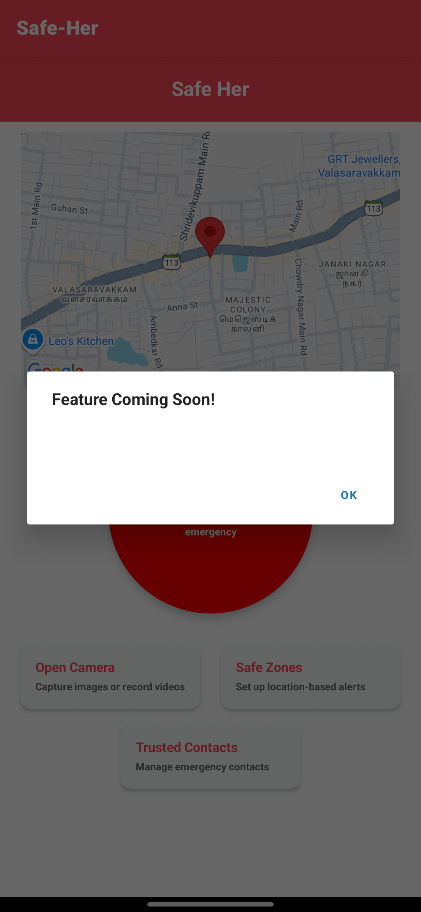

# 🚨 Safe Her - Women Safety Emergency App


**Safe Her** is a purpose-built React Native application using Expo that empowers women to stay safe during emergencies. With just a shake of the phone or a long press, the app can instantly alert trusted contacts with the user’s live location, capture real-time media, and initiate emergency communication.

---

## 🌟 Mission

**Empowering women's safety through technology.**  
Safe Her aims to offer a reliable, quick-response safety companion designed specifically for women, especially in distress situations.

---

## 📱 Features

- 📍 **Real-time GPS tracking** for instant location updates  
- 🗺️ **Live map display** of user’s current position  
- 🚨 **Emergency SOS trigger** via phone shake or long-press  
- 📸 **Camera capture** for collecting visual evidence  
- 📞 **Auto SMS and emergency call** to trusted contacts  
- 💾 **Local storage** of emergency contacts using AsyncStorage  
- ⚠️ **Modular design** for future features like Safe Zones and Contact Management

---

## 🛠 Required Libraries

Install the following libraries to get started:

```bash
npm install react-native-maps
npm install expo-location
npm install expo-sensors
npm install expo-router
npm install @react-native-async-storage/async-storage
```

---

## 🚀 Getting Started

1. **Clone the repository**
   ```bash
   git clone https://github.com/adharsh-ak/safe-her.git
   cd safe-her
   ```

2. **Install dependencies**
   ```bash
   npm install
   ```

3. **Run the Expo server**
   ```bash
   npx expo start
   ```

4. **Open the app**
   - Scan the QR code with **Expo Go** (Android/iOS)
   - Or use an **emulator/simulator**

5. **Grant required permissions**
   - Location  
   - Camera  
   - SMS and Phone (for emergency actions)

---

## ⚙️ Technical Notes

- **Shake detection** triggers at acceleration > `2.5`
- **Emergency message** includes a **Google Maps location link**
- **Trusted contacts** stored in AsyncStorage under key: `trustedContacts`
- **Linking API** is used for SMS and phone calls

---

---

## 📸 Screenshots
---

### Home Screen  


### SOS Activation  


### New Features UI  


### Expo Start  


### Desktop Screenshot  


---

## 🎬 Demo Video

[Click here to watch the full screen recording of the app in action](./output.mp4)


## Join the community

Join the community of developers creating universal apps.

- [Expo on GitHub](https://github.com/expo/expo): View open source platform and contribute.
- [Discord community](https://chat.expo.dev): Chat with Expo users and ask questions.


## 📄 License

This project is licensed under the **MIT License**.
